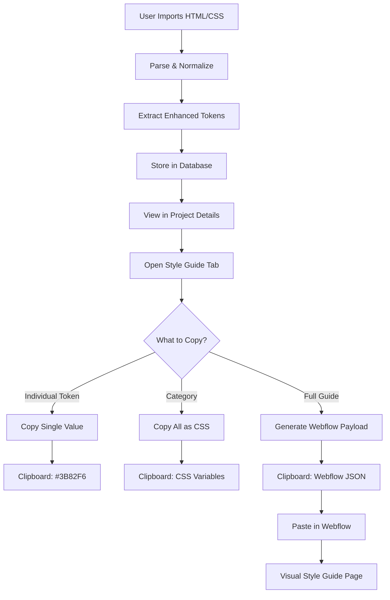
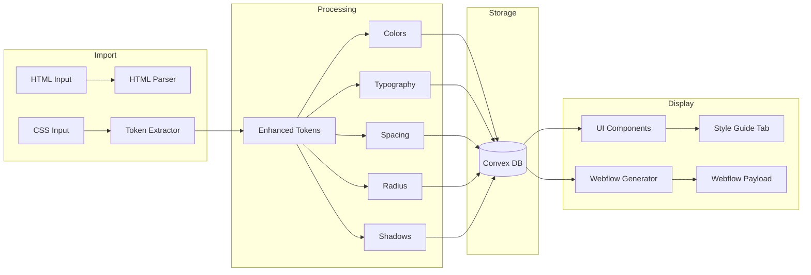
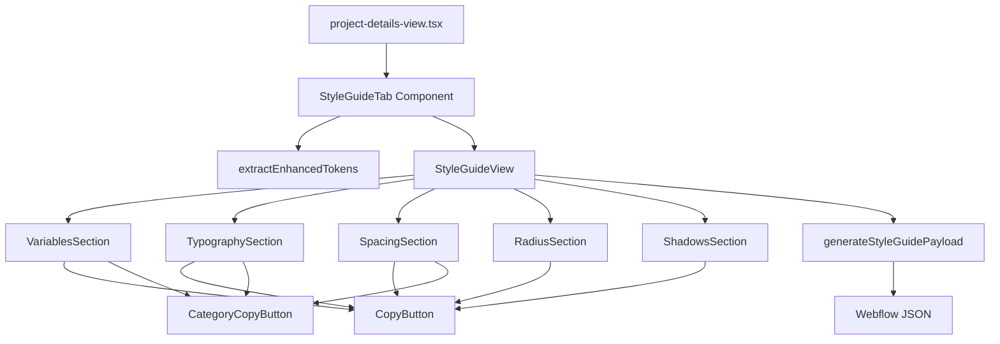
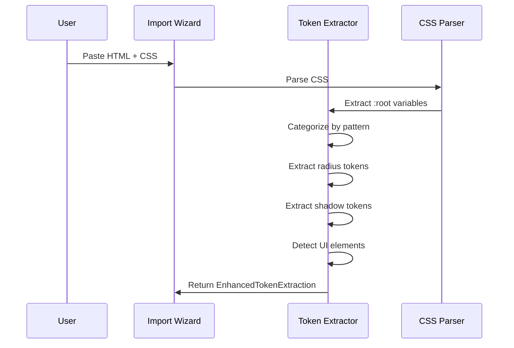
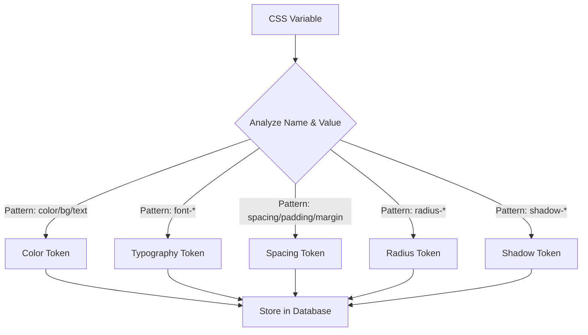
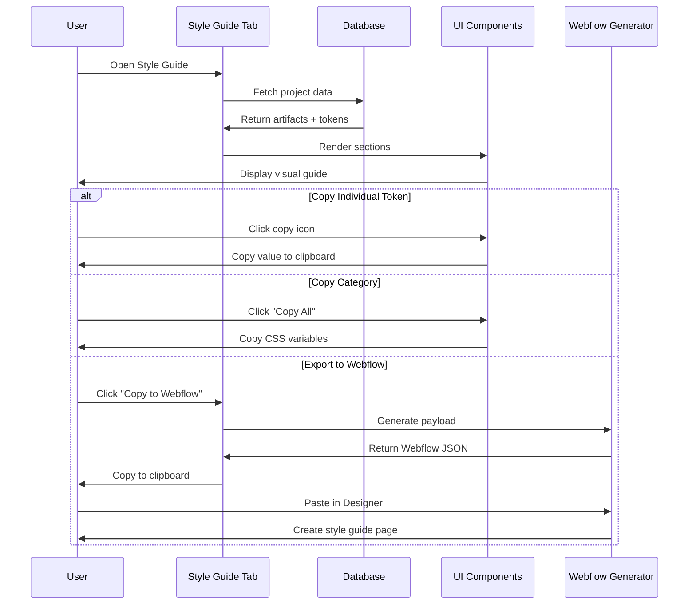
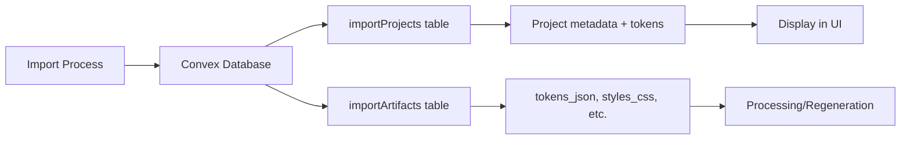
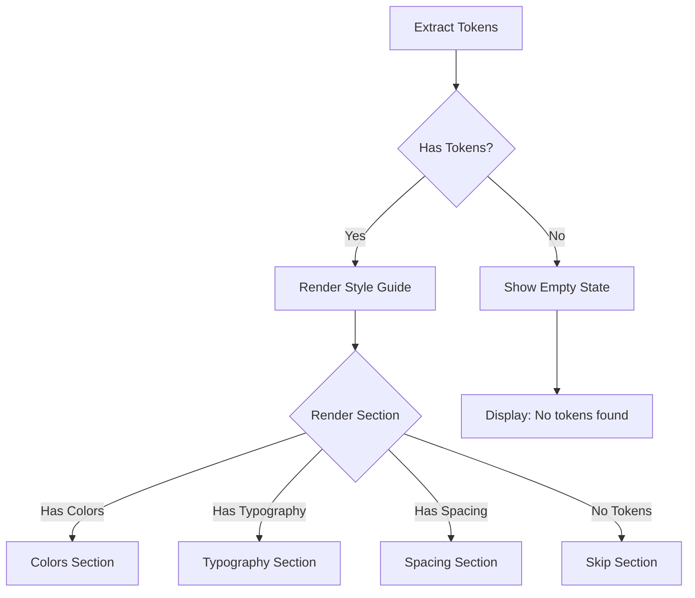

# Style Guide Workflow & Architecture

## User Workflow

This document explains how the Style Guide feature integrates into the import and export workflow.

### Complete Import-to-Webflow Flow



## Technical Architecture

### Data Flow



### Component Hierarchy



## Token Extraction Pipeline

### Phase 1: CSS Parsing



### Phase 2: Token Categorization



### Phase 3: Display & Export



## Token Detection Logic

### Color Detection

```typescript
// Pattern matching
const isColor = 
  name.includes('bg') ||
  name.includes('text') ||
  name.includes('color') ||
  value.startsWith('#') ||
  value.startsWith('rgb') ||
  value.startsWith('hsl');
```

### Radius Detection

```typescript
// Must use --radius- prefix
const radiusPattern = /--radius-([\w-]+)\s*:\s*([^;]+);/g;

// Size categorization
if (name.includes('small')) size = 'small';
if (name.includes('medium')) size = 'medium';
if (name.includes('large')) size = 'large';
```

### Shadow Detection

```typescript
// Must use --shadow- prefix
const shadowPattern = /--shadow-([\w-]+)\s*:\s*([^;]+);/g;

// Intensity levels
const intensityMap = {
  'xxs': 'xxsmall',
  'xs': 'xsmall',
  'sm': 'small',
  'md': 'medium',
  'lg': 'large',
  'xl': 'xlarge',
  'xxl': 'xxlarge'
};
```

## Copy Functionality

### Individual Token Copy

```typescript
async function copyToken(value: string) {
  await navigator.clipboard.writeText(value);
  // Output: "#3B82F6"
}
```

### Category Copy

```typescript
async function copyCategory(tokens: Token[]) {
  const css = `:root {\n${tokens.map(t => 
    `  --${t.name}: ${t.value};`
  ).join('\n')}\n}`;
  await navigator.clipboard.writeText(css);
  // Output: Full CSS variable block
}
```

### Webflow Payload Generation

```typescript
function generateStyleGuidePayload(tokens) {
  // 1. Create container and section nodes
  // 2. Generate color swatches with inline styles
  // 3. Create typography samples
  // 4. Build spacing/radius/shadow demonstrations
  // 5. Package as Webflow JSON
  return webflowPayload;
}
```

## State Management

### Token Storage



### Runtime Extraction

When opening the Style Guide tab:

1. Fetch project artifacts from database
2. Extract `styles_css` artifact content
3. Run `extractEnhancedTokens()` on CSS
4. Generate structured token data
5. Pass to `StyleGuideView` component
6. Render visual sections

## Performance Considerations

### Optimization Strategies

1. **Lazy Loading**: Style Guide tab only processes tokens when opened
2. **Memoization**: Token extraction cached during tab session
3. **Incremental Rendering**: Sections render independently
4. **Efficient Parsing**: Regex-based token extraction (no DOM parsing)

### Scale Limits

| Metric | Recommended | Maximum |
|--------|-------------|---------|
| Color tokens | 20-50 | 200 |
| Typography tokens | 5-10 | 50 |
| Spacing tokens | 8-12 | 30 |
| Radius tokens | 4-6 | 15 |
| Shadow tokens | 5-7 | 20 |

**Note:** Large token sets may cause:
- Slow initial render (first open of tab)
- Large Webflow payloads (clipboard size limits)
- Cluttered UI (too many tokens to scan)

## Error Handling

### Graceful Degradation



### Error States

1. **No Tokens Detected**: Display helpful message with token format example
2. **Extraction Failed**: Catch error, show fallback UI
3. **Copy Failed**: Toast notification with error message
4. **Webflow Generation Failed**: Log error, notify user

## Extension Points

### Adding New Token Types

To add a new token category (e.g., "Animations"):

1. **Update `lib/token-extractor.ts`:**
```typescript
export interface AnimationToken {
  name: string;
  value: string;
  duration: string;
}

export interface EnhancedTokenExtraction {
  // ... existing types
  animations?: AnimationToken[];
}

export function extractAnimationTokens(css: string): AnimationToken[] {
  // Implementation
}
```

2. **Create component:**
```
components/project/style-guide/animations-section.tsx
```

3. **Update `style-guide-view.tsx`:**
```typescript
{tokens.animations && tokens.animations.length > 0 && (
  <AnimationsSection tokens={tokens.animations} />
)}
```

4. **Update schema:**
```typescript
// convex/schema.ts
animations: v.optional(v.array(v.object({
  name: v.string(),
  value: v.string(),
  duration: v.string(),
})))
```

5. **Update Webflow generator:**
```typescript
// lib/webflow-style-guide-generator.ts
if (tokens.animations) {
  const animationSectionId = generateAnimationsSection(...);
  childrenIds.push(animationSectionId);
}
```

## Testing Checklist

- [ ] Import project with all token types
- [ ] Verify Style Guide tab appears
- [ ] Check each section renders correctly
- [ ] Test individual token copy
- [ ] Test category copy (verify CSS format)
- [ ] Test Webflow export
- [ ] Verify Webflow paste creates visual guide
- [ ] Test with projects missing certain token types
- [ ] Test with empty project (no tokens)
- [ ] Test responsive layout (mobile, tablet, desktop)

## Resources

- [User Documentation](./STYLE_GUIDE.md)
- [Implementation Details](../STYLE_GUIDE_IMPLEMENTATION.md)
- [Quick Reference](./STYLE_GUIDE_QUICK_REFERENCE.md)
- [System Manifest](../../SYSTEM_MANIFEST.md)

---

**Document Version:** 1.0  
**Last Updated:** January 24, 2026
